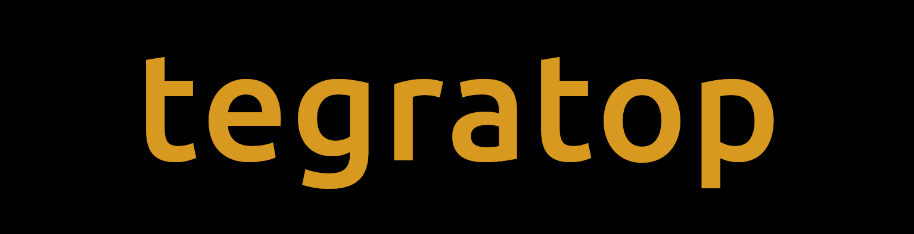

<div align="center">
  
  <h2> TUI for monitoring Nvidia jetson boards </h2>
  

</div>

## 🚀 Installation

### 📥 Binary release

You can download the pre-built binaries from the release page [release page](https://github.com/pythops/tegratop/releases)

### 📦 crates.io

You can install `tegratop` from [crates.io](https://crates.io/crates/tegratop)

```shell
cargo install tegratop
```

### ⚒️ Build from source

To build from the source, you need [Rust](https://www.rust-lang.org/) compiler and
[Cargo package manager](https://doc.rust-lang.org/cargo/).

#### On a Jetson board

Run the following command:

```shell
cargo build --release
```

This will produce an executable file at `target/release/tegratop` that you can copy to a directory in your `$PATH`.

#### Cross compilation

Make sure you have those dependencies installed:

- [cross](https://github.com/cross-rs/cross)
- [podman](https://github.com/containers/podman)

then run the following command to build:

```shell
CROSS_CONTAINER_ENGINE=podman cross build --target=aarch64-unknown-linux-gnu --release
```

## 🪄 Usage

run `tegratop` with sudo to get full the stats, otherwise some information might not show

```
$ sudo tegratop
```

## ⚖️ License

GPLv3
